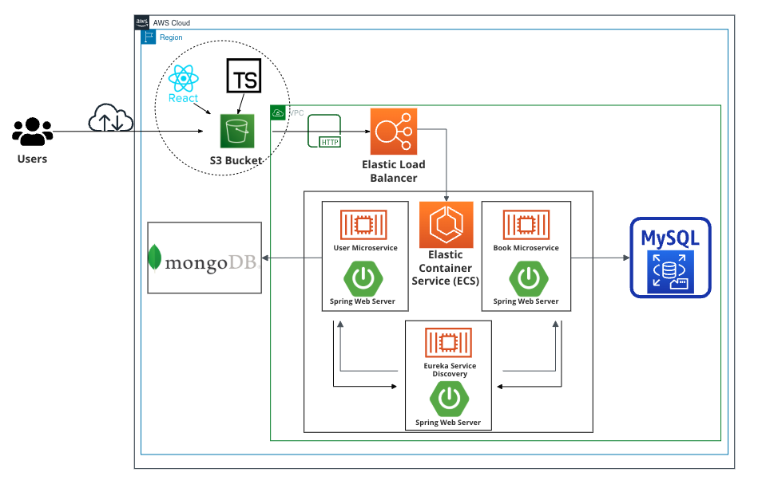

# Cloud-Based Microservices Implementation of Containerized Library Application
## Overview:
An end-to-end full stack MVC application with a microservices-architecture based backend, with Eureka service discovery implemented for inter-microservice communication and a Spring API Gateway to serve as a single entrypoint for services. Services were packaged into containers and deployed on an Amazon Elastic Container Service (ECS) Cluster enabling independent scalability. Integrated Elastic Load Balancer (ELB) on the deployed cluster's services to route and load balance requests. Frontend deployed on S3 bucket, databases deployed on MongoDB cluster (AWS provided) and RDS MySQL instance, making it a fully cloud-based solution.
## Features:
- Establishes protected routes on React frontend that only opens when user has logged in (saves login session to browser's local storage), with default route being login
- Hashes registered password sent to the backend using BCryptEncoder when stored on the database
- Robust error-checking on frontend that determines whether user has 1) already checked out book 2) added book to checkout before 3) Find no more available of selected book, before checkout
## Technologies used:

	<code></code>
	<code></code>
	<code></code>
	<code></code>
	<code></code>
	<code></code>
	<code></code>
	<code></code>
	<code></code>
	<code></code>

## Architectural Diagram:

